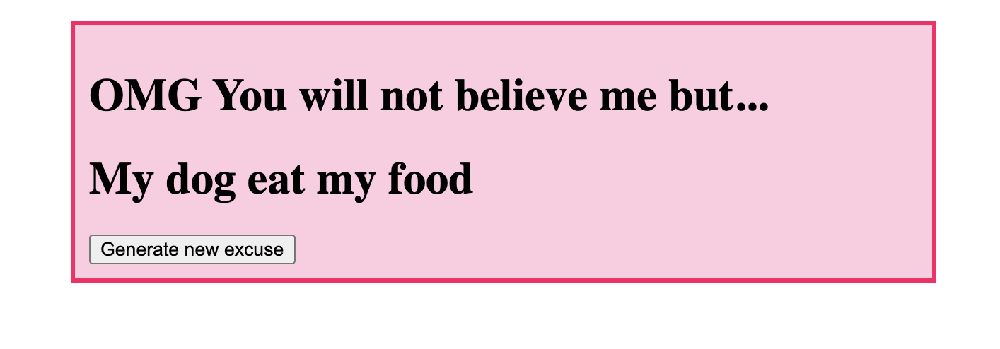

## The Excuse Generator

## The Goal

We wanted a project that uses very little Javascript but still with a very fun application. The excuse generator takes
20 lines of code, is super simple to understand and is the perfect first project for any beginner developer.

## Technologies

HTML, CSS3, Sass, Javascript, Webpack.

## Fundamentals

This exercise covers the following fundamentals:

1. Using external Javascript files in your project.
2. How to work with Arrays.
3. Generating random numbers.
4. Concatenating strings.
5. Using functions (at least a bit).
6. Working with events (at least a bit).
